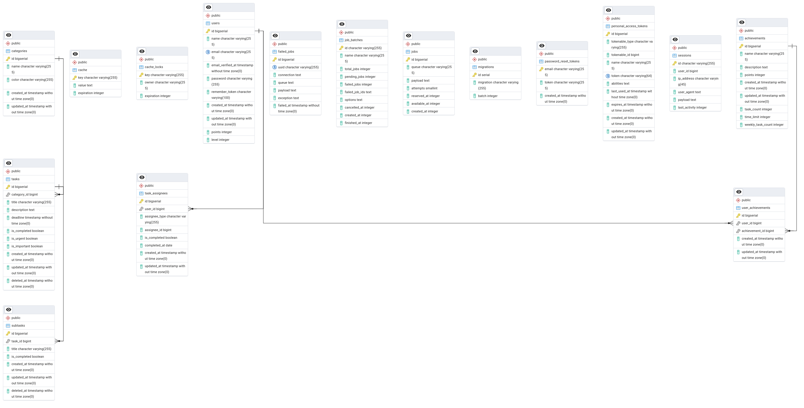

## TODO List Application

### Desafio
* **Objetivo:** Desenvolver uma aplicação TODO list funcional em 48 horas.
* **Recursos Extras:** Implementar funcionalidades adicionais para demonstrar habilidades técnicas.

### Tecnologias Utilizadas
* **Backend:** Laravel 8, PostgreSQL 15, Redis
* **Frontend:** Vue 3 com Quasar
* **Ferramentas:** Docker, Docker Compose, pgAdmin 4

### Funcionalidades Principais

* Criação e Edição de Tarefas: Crie tarefas com detalhes como título, descrição, data de vencimento e prioridade.
*    Subtarefas: Divida tarefas complexas em subtarefas menores para melhor organização.
*    Alertas: Receba notificações antes das datas de vencimento para garantir que nada seja esquecido.
*    Priorização Inteligente: Possibilidade de marcar tarefas como urgente e importante.
*    Gamificação: Acumule pontos ao realizar as tarefas conforme os desafios.

### Arquitetura do Sistema
#### Diagrama de Arquitetura 

### Configuração do Projeto
* **Clonagem:** `clonar o repositorio`
* **Configuração:**
    * Editar o arquivo `.env.example` para `.env`
* **Início:** `docker-compose up --build`
* **Instalar Dependências do Backend (Laravel):**

Para instalar as dependências do Laravel, use a imagem oficial do Composer diretamente. Execute o seguinte comando para rodar o composer install no container do backend:

docker-compose run --rm backend composer install

Isso irá utilizar a imagem do Composer para instalar as dependências do backend corretamente.

* **Instalar Dependências do Frontend (Vue 3 com Quasar):**

Se você não tem o Node.js/NPM instalado, execute o comando abaixo dentro do container do frontend para instalar as dependências do Vue com Quasar:

docker-compose exec frontend npm install
* **Acesso:**
    * Frontend: http://localhost:9000
    * Backend: http://localhost:8080
