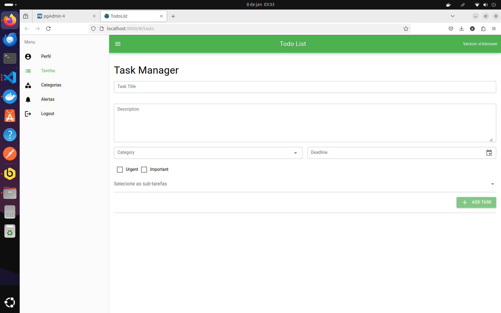

# TODO List Application

## Desafio

**Objetivo:** Desenvolver uma aplicação TODO list funcional em 48 horas.

**Recursos Extras:** Implementar funcionalidades adicionais para demonstrar habilidades técnicas.

---

## Tecnologias Utilizadas

### Backend
- **Framework:** Laravel 8
- **Banco de Dados:** PostgreSQL 15
- **Cache e Filas:** Redis

### Frontend
- **Framework:** Vue 3
- **Biblioteca UI:** Quasar

### Ferramentas
- **Containerização:** Docker, Docker Compose
- **Gerenciador de Banco:** pgAdmin 4

---

## Funcionalidades Principais

- **Criação e Edição de Tarefas:** Crie tarefas com detalhes como título, descrição, data de vencimento e prioridade.
- **Subtarefas:** Divida tarefas complexas em subtarefas menores para melhor organização.
- **Alertas:** Receba notificações antes das datas de vencimento para garantir que nada seja esquecido.
- **Priorização Inteligente:** Possibilidade de marcar tarefas como urgente e importante.
- **Gamificação:** Acumule pontos ao realizar as tarefas conforme os desafios.

---

## Arquitetura do Sistema

### Diagrama de Arquitetura


---

## Configuração do Projeto

### 1. Clonagem do Repositório
```bash
git clone <URL_DO_REPOSITORIO>
cd <PASTA_DO_PROJETO>
```

### 2. Configuração
- Copie o arquivo de exemplo `.env` e renomeie para `.env`.
```bash
cp .env.example .env
```
- Ajuste as variáveis de ambiente conforme necessário.

### 3. Inicialização do Ambiente
- Inicie os serviços utilizando Docker Compose:
```bash
docker-compose up -d
```

### 4. Instalação de Dependências

#### Backend (Laravel)
Para instalar as dependências do Laravel, utilize o seguinte comando:
```bash
docker run --rm --interactive --tty \
  --volume $PWD/backend:/app \
  --volume ${COMPOSER_HOME:-$HOME/.composer}:/tmp \
  composer/composer install
```

```bash
docker run --rm --interactive --tty \
  --volume $PWD/backend:/app \
  --workdir /app \
  node:20 npm install
```

#### Frontend (Vue 3 com Quasar)
```bash
docker run --rm --interactive --tty \
  --volume $PWD/frontend:/app \
  --workdir /app \
  node:20 npm install
```

### 5. Geração da Chave da Aplicação
Após a instalação das dependências do Laravel, gere a chave da aplicação:
```bash
docker exec -it <nome_do_container_backend> php artisan key:generate
```
Substitua `<nome_do_container_backend>` pelo nome do container correspondente ao backend no seu arquivo `docker-compose.yml`.

### 6. Acesso à Aplicação
- **Frontend:** [http://localhost:9000](http://localhost:9000)
- **Backend:** [http://localhost:8080](http://localhost:8080)

---

## Instruções Gerais
É necessario observar os logs dos containers para ver se todos subiram corretamente. Comigo aconteceram diversos erros de permissão de arquivo, sendo necessario rodar chmod 777.

Coloquei algumas imagens do sistema em funcionamento que está na pasta images. Abaixo está a tela principal ao se logar:



## Importante

Voce deve abrir a parte do backend no navegador na rota /register, para efetuar o primeiro registro. Apos isso, com os dados do usuario cadastrado em mãos, vá para o front end e continue o fluxo de login, criação de tarefas, etc.

Também é necessario rodar o seed do banco para subir os achievements, que são as conquistas quando o usuario cumpre os desafios.

```bash
php artisan db:seed
```


---

